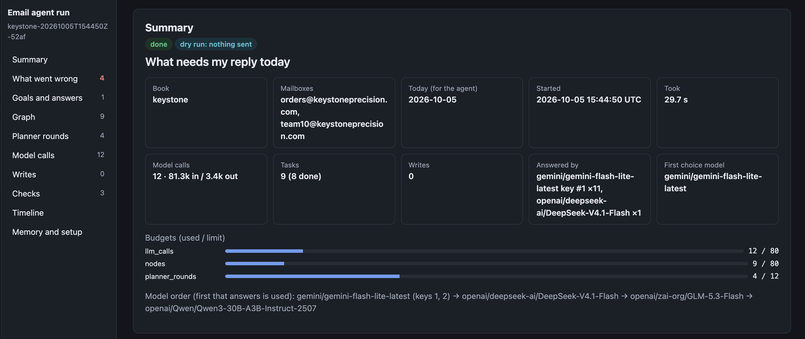
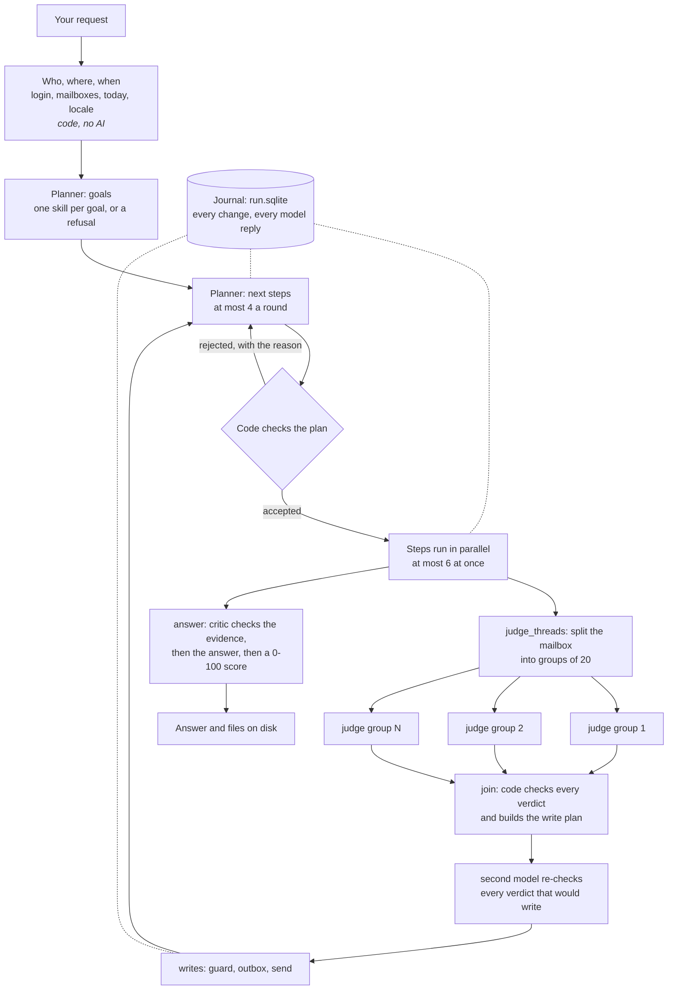
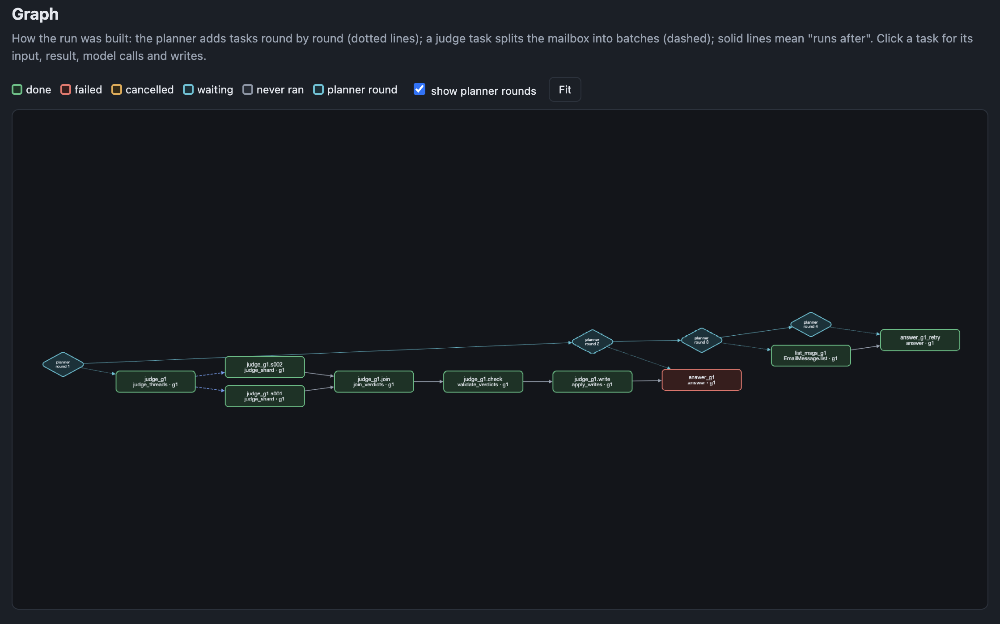
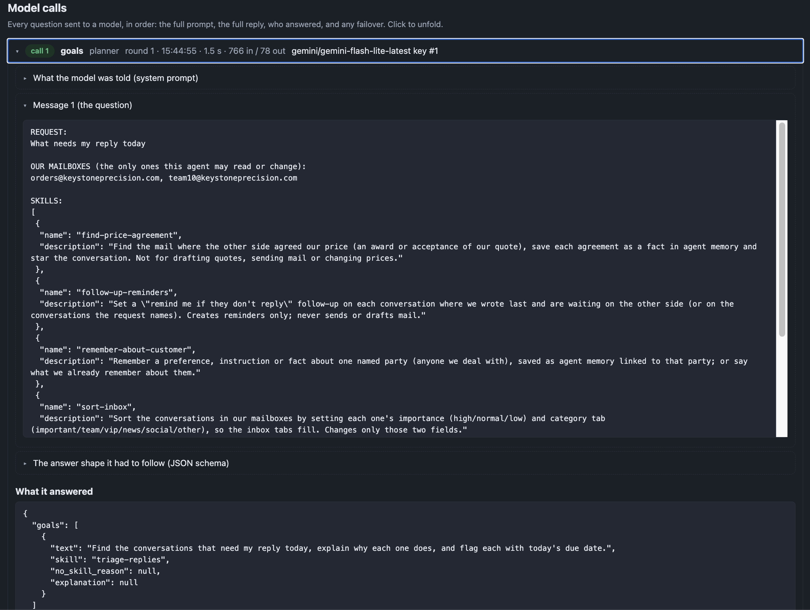
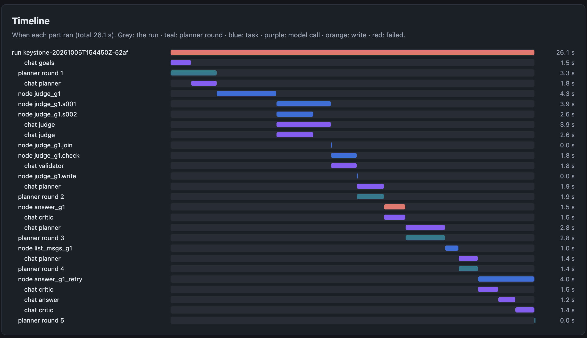

# An email agent for AgentSwitch: Team 10, Email seat

An AI agent that works a company mailbox on the AgentSwitch platform. You ask it in plain English ("What needs my
reply today, and find the mail where they agreed the price."). It reads the mail, decides what needs doing, makes
the changes on the platform, and tells you what it did and why.

It was built for the AgentSwitch capstone course, for the **Email seat** (one job in a simulated company). The same
agent works unchanged on two company "books":

| Book | Company | Country, money, tax |
|---|---|---|
| **Suryodaya** | Suryodaya Precision Works | India, rupees, GST |
| **Keystone** | Keystone Precision Works LLC | United States, dollars, sales tax |


<!-- screenshot: docs/images/README.md, item 1 -->

**In numbers:**
- About 10,300 lines of agent code and 1,000 lines of harness. No agent framework.
- 69 tests and 4 load tests, which run in about 7 seconds with no network.
- A load test on a 50,000-message mailbox.
- 25 bug reports filed against the platform.

---

## Contents

1. [A 5-minute tour](#1-a-5-minute-tour)
2. [What it does, and what it refuses](#2-what-it-does-and-what-it-refuses)
3. [How a run is orchestrated](#3-how-a-run-is-orchestrated)
4. [The parts, one by one](#4-the-parts-one-by-one)
5. [No agent framework](#5-no-agent-framework)
7. [Design decisions, and why](#7-design-decisions-and-why)
8. [Platform bugs we found, and how the agent works around them](#8-platform-bugs-we-found-and-how-the-agent-works-around-them)
9. [One real run, step by step](#9-one-real-run-step-by-step)
10. [How it is tested](#10-how-it-is-tested)
11. [Load test: 50,000 emails](#11-load-test-50000-emails)
12. [The harness: checked by the database, not by the agent's words](#12-the-harness-checked-by-the-database-not-by-the-agents-words)
13. [Seeing a run: the run page, traces, Jaeger](#13-seeing-a-run-the-run-page-traces-jaeger)
14. [Planned: the Jev decision model](#14-planned-the-jev-decision-model)
15. [Setting it up and running it](#15-setting-it-up-and-running-it)
16. [What a run leaves on disk](#16-what-a-run-leaves-on-disk)
17. [Where things stand](#17-where-things-stand)
18. [Repository layout](#18-repository-layout)
19. [Where to read more](#19-where-to-read-more)

---

## 1. A 5-minute tour

If you have five minutes, look at these, in this order:

| # | Look at | What you will see |
|---|---|---|
| 1 | [`email_agent/agent.py`](email_agent/agent.py) | One run from start to finish, with crash handling and resume (`run`, `resume`, `_graph`) |
| 2 | [`email_agent/graph/planner.py`](email_agent/graph/planner.py), `_check` | How code checks every plan the model proposes before anything happens |
| 3 | [`email_agent/graph/workers.py`](email_agent/graph/workers.py), `judge_threads` and `validate_verdicts` | Mailbox-wide work split into parallel groups, and a second model checking the first |
| 4 | [`email_agent/graph/outbox.py`](email_agent/graph/outbox.py) and [`reconcile.py`](email_agent/graph/reconcile.py) | Why a write is never sent twice, even after a crash |
| 5 | [`tests/test_resume.py`](tests/test_resume.py) and [`tests/test_concurrency.py`](tests/test_concurrency.py) | What we test: crashes, timeouts, two things happening at once |
| 6 | `uv run pytest` | 69 tests in about 7 seconds, with no network and no keys |

---

## 2. What it does, and what it refuses

You ask in plain English. The agent splits the request into **goals** and picks one **skill** for each.

| Skill | Ask it | What it changes on the platform |
|---|---|---|
| Triage replies | "What needs my reply today?" | Flags each conversation that needs a reply, due today, and says why |
| Find price agreements | "Find the mail where they agreed the price." | Saves each agreed price as a memory on that customer, with figures checked by code, and stars the conversation |
| Summarise conversations | "Summarise each conversation." | Writes the summary field where it is missing or out of date |
| Follow-up reminders | "Remind me where I am waiting on a reply." | Creates a "remind me if they don't reply" reminder |
| Remember about a customer | "Remember that Cardinal wants every quote in USD." | Saves (or reads back) a memory linked to that customer |
| Sort the inbox | "Sort my inbox." | Sets each conversation's importance and category |

It **refuses**, changes nothing, and records the reason as data when a request:
- needs another department's data, such as a salary → *out of seat*;
- is about a mailbox that is not ours → *not our mailbox*;
- asks for something this seat must not do, such as sending mail → *not permitted*;
- has no support in the mail, such as a price nobody agreed → *no evidence* or *unknown record*.

A request can mix both kinds. "What needs my reply today, and what is Ravi's salary?" answers the first part and
refuses the second, in the same run.

---

## 3. How a run is orchestrated

A run is a **graph that grows while it runs**. The planner (an AI model) adds a few steps. The steps run, in
parallel where they can. Their results go back to the planner, which adds the next steps. This goes on until every
goal has an answer or a refusal. Everything that happens is written to a journal first, so a run can stop at any point
and be resumed.



The planner never sees each judging group. It sees one summary after the join: counts, problems and the write
plan. So the number of planning calls does not grow with the size of the mailbox.

---

## 4. The parts, one by one

### The planner ([`graph/planner.py`](email_agent/graph/planner.py))

The planner makes two kinds of calls:
1. **Goals.** It turns the request into 1–8 goals. Each goal gets exactly one skill, or no skill and a refusal reason.
   A goal with no skill is refused by code; the model is never asked how to refuse it.
2. **Next steps.** It is shown the graph so far (each result cut to 4,000 characters) and adds at most 4 tasks.

**Code checks every plan before it reaches the graph** (`_check`). A plan is sent back with the reason, up to 3
times, if:
- a task uses a capability that is not offered for its goal's skill;
- its arguments do not pass the capability's typed model;
- it repeats work that already exists (then it is dropped, and anything waiting on it waits on the original);
- it waits on a step that does not exist, or on one that failed;
- it writes to a conversation the two models disagreed on (that conversation is for you to check);
- it is an answer added in the same round as its goal's work, before any result.

**The planner can never declare the run finished.** Code finishes it when every goal has an answer or a refusal. The
planner is not even called while every open goal still has work running. When the graph grows past 40,000
characters, finished goals' tasks and then the oldest results are folded behind a visible "compacted" marker, so
nothing disappears without a trace.

### The executor ([`graph/executor.py`](email_agent/graph/executor.py))

The executor runs the steps:
- **Parallel:** up to 6 steps at once, waking on the first to finish (`asyncio.wait`, first completed).
- **Time limit:** each step has its own time limit.
- **Cancelling:** a cancelled step's late result is thrown away.
- **Fan-out wiring:** when a step splits into groups (a "fan-out"), anything already waiting on it is made to wait
  for the fan-out's final step too. This was found live, when an answer ran before the groups had been judged.
- **A failure is an outcome:** a step that fails (timeout, budget, bad output, error) becomes a result the planner
  reads, never a crash.

### The journal ([`graph/store.py`](email_agent/graph/store.py))

The run's whole state lives in one SQLite file, `runs/<id>/run.sqlite`:
- **What is in it:** steps and their links, a numbered event journal, budgets, waiting steps, the outbox, and every
  model reply.
- **Every change is one transaction**, together with its journal event.
- **Exactly one plan per event:** each planner patch is recorded against the event that caused it. After a crash,
  every outcome without a plan is planned again exactly once.
- **Budgets survive a resume:** per run, 12 planner rounds, 80 model calls and 80 steps.
- **Saved replies are reused:** every model reply is saved under (step, hash of the request). A resumed run gets the
  same reply for free.

### Fan-out and the judging groups ([`graph/workers.py`](email_agent/graph/workers.py), [`graph/flows.py`](email_agent/graph/flows.py))

Mailbox-wide skills work like this:
1. `judge_threads` picks the candidates **with code**. For triage, those are the conversations whose newest real
   message is from the other side and unanswered.
2. It splits them into groups of 20 and adds one judging step per group, plus a join, a check and a write step.
3. **Each judging call must return exactly one verdict per given conversation.** Any extra, missing or repeated id is
   sent back once for repair.
4. **The join** (code) drops invalid verdicts and builds the write plan. A planned write is never the same write
   twice.
5. **The fan-out is sized to what the run's budget can pay for.** A 10,000-conversation sort judges the newest groups
   that fit and reports how many it left, rather than running out halfway (found by the load test, section 11).

### The second model: the validator

Before anything is written, **a different model** re-judges every verdict that would cause a write, plus 5 of the
others, to spot misses:
- It uses the same prompt, in a fresh context, and is read-only.
- Only writes both models agree on go out.
- A disputed conversation is **held** and listed under "Needs your check". Code refuses any later attempt to write it.
- If the check cannot finish (for example, the budget runs out), the unchecked conversations are held too. Nothing is
  written unchecked.
- With no second model configured, the check is skipped, and the run says so.

### The critic and the verifier

**The critic:** before a goal ends with an answer (or a refusal that rests on evidence), it reads the goal's evidence
and says whether it is enough:
- "Not ready" fails the step, with what is missing, so the planner adds work.
- After 2 rejections of the same goal it is overruled: the gap counts as unavailable, so the agent never searches
  forever.
- A broken critic reply never blocks a goal.

**The verifier:** after the answer, it scores it from 0 to 100 against the evidence and writes a short critique. It is
kept as evidence only; it never changes the answer.

### Capabilities and skills ([`graph/capabilities.py`](email_agent/graph/capabilities.py), [`skills/`](email_agent/skills))

Each skill is a `SKILL.md` file: a name, the tools it may use, and its rules in plain words. The capability registry
is built from them:
- Every tool has typed arguments (pydantic models generated from the platform's own tool schemas).
- Every tool is marked as reading or writing.
- A goal may use only its skill's tools, plus `answer` and `refuse`.

### The write path ([`platform/writes.py`](email_agent/platform/writes.py))

Every write goes through one path:
1. **Guard:**
   - Creating is allowed.
   - Updating is allowed only for rows in our mailboxes, or rows our login created.
   - Deleting is allowed only for rows this run created.
   - A run started by the watcher may change only its own conversation.
2. **Dry run:** the write is recorded, but not sent.
3. **Outbox:** the write is recorded *before* it is sent. A write already completed reuses its receipt. A write left
   halfway by a crash is never sent again blindly.
4. **Send:** through MCP, or through REST when a field must be set to empty (MCP cannot send an empty value).
5. **Record:** `writes.jsonl`, with each field's value before and after, so every write can be undone.
6. **Local copy:** the run's copy of the mailbox is updated, so later steps in the run see the change.

### Reconcile and resume ([`graph/reconcile.py`](email_agent/graph/reconcile.py))

`--resume` continues a stopped run in its own folder. First, every write left uncertain is settled **by reading the
live row on the platform**:
- **happened:** the row holds what we sent. It is recorded once.
- **not sent:** the row still holds the old values. The step sends it again.
- **changed:** someone else changed the row since. It is never overwritten.
- **unreadable:** it stays uncertain, and the step keeps waiting.

Then steps that were running run again, and saved model replies are reused. A write the platform never answered
during a run (a timeout) is settled the same way before the run ends.

### The local copy of the mailbox ([`mailbox/`](email_agent/mailbox))

The platform answers about one call per second (measured), so the agent keeps its own copy of our mailboxes in
SQLite.
- **It is synced by watermark:** the first time, every page; after that, only what changed. An unchanged mailbox
  costs one call per table.
- **Code works out the facts** of each conversation from its own messages: who wrote last, whether we replied, our
  last message, the price lines.
- **It does not trust two kinds of platform data:**
  - the platform's own "last sender" fields, which are stale (BUG-005);
  - word-for-word mirror copies in the sample mail, which do not count as replies (BUG-022).
- **Full-text search** uses SQLite FTS5. Search by meaning (embeddings) is built but off by default.

### Memory ([`memory/`](email_agent/memory))

Memory has eight layers. Each has one store, one lifetime, and one rule for how it reaches a prompt.

| # | Layer | Where it lives | How it reaches the model |
|---|---|---|---|
| 1 | Instructions: prompts, skills, your house rules per company | `prompts/`, `skills/`, `rules/<book>.md` | in the instructions of every role |
| 2 | What we know about customers | the platform's agent memory, plus a local read copy synced by watermark | the `recall_memory` tool: a customer's memories, then the company's |
| 3 | Verdict cache | `memory.sqlite`, keyed by the conversation's content, skill and prompts | never: it replaces a judging call |
| 4 | The run's working memory | the graph in `run.sqlite` | the clipped graph |
| 5 | Large results | `runs/<id>/artifacts/`, named by content | a preview and the artifact id |
| 6 | The run's to-do list | the graph's pending steps | the graph |
| 7 | Earlier runs on this mailbox | one record per run | "recent runs" in the planner's first round |
| 8 | Compaction | in place | the visible "compacted" marker |

A recall for one customer returns that customer's memories and the company's, never another customer's. Every
memory keeps its source. The agent adds memory only through `remember_fact`, which refuses an unknown customer and
skips an exact repeat.

### The inbox watcher ([`watch/`](email_agent/watch))

The platform cannot notify us, so the watcher polls every 2 minutes. Each new inbound message becomes an event:
- **Stored once by its key**, so it is never handled twice, even after a restart.
- **Then checked by the governor**, which refuses an event when:
  - **it was caused by us:** the row was changed within 5 minutes of a write we sent. Our own record of writes
    decides this, because the agent and the person share one login.
  - **it is part of a flood:** more than 30 events a minute from one mailbox.
  - **a daily ceiling is used up:** runs per day, or model calls per day. Each run reserves its share when it is
    admitted, so runs started together can never spend past the ceiling.
- **Admitted events** start a run limited by code to that one conversation. It is a **dry run** unless the
  subscription and the watcher both say live.

Every refusal is recorded with its reason.

### The model route ([`llm/route.py`](email_agent/llm/route.py))

Every model call goes to the first usable option on one ordered route:
- **The options:** Gemini (keys 1–5, failover only), then W&B models (DeepSeek-V4.1-Flash → GLM-5.3-Flash →
  Qwen3-30B).
- **When an option fails:**
  - a rate limit rests that option for as long as the server asks;
  - a used-up daily quota rests it until midnight Pacific;
  - server trouble rests it for a minute;
  - a refused key or an unknown model drops it.
- **Who answered:** every reply records the provider, the model and the key slot (never the key).
- **W&B reasoning:** off by default (`WANDB_THINKING=false`), for speed (section 15).

---

## 5. No agent framework

The loop that runs the agent is our own code. There is **no LangGraph, no LangChain, and no networkx**:
- The graph's cycle check uses the Python standard library (`graphlib`).
- State lives in SQLite (`sqlite3`).
- Concurrency is plain `asyncio`.
- Every boundary between parts has a **pydantic** contract (`email_agent/contracts/`).

| Library | What it is used for |
|---|---|
| `mcp` (official SDK) | talking to AgentSwitch's MCP server |
| `httpx2` | REST calls (login, and setting a field to empty) |
| `google-genai`, `openai` | Gemini, and W&B's OpenAI-compatible endpoint |
| `pydantic`, `pydantic-settings` | every contract and every setting |
| `tenacity` | retries with back-off |
| `faiss-cpu`, `numpy` | search by meaning (off by default) |
| `rich`, `pyyaml` | the terminal view; task and subscription files |
| `opentelemetry-*` (optional) | sending traces to a tracing tool |
| `pytest`, `pytest-asyncio`, `ruff`, `mypy`, `import-linter` | tests and checks |

---

## 7. Design decisions, and why

| Decision | Why |
|---|---|
| **A local copy of the mailbox** | The platform answers about one call per second. A 10,000-message mailbox read on every step would take minutes; synced by watermark, an unchanged mailbox costs one call per table |
| **Groups of 20, judged in parallel** | Planner calls stay at about 3–8 per run whatever the inbox size; each group is its own step: timed, retried, resumable, cached |
| **Code decides the facts; the model judges** | The platform's thread fields are stale (BUG-005) and the sample mail has mirror copies (BUG-022); a model reading them was wrong, code reading the messages is not |
| **Two models must agree before a write** | On Keystone, price verdicts on order confirmations changed between runs; the second model held 9 of 15, which would otherwise have been written on a coin toss |
| **Polling, not push** | The platform has no way to notify us |
| **Dry run by default for unattended runs** | The books are shared with other teams; a watcher run writes only when you say so twice |

---

## 8. Platform bugs we found, and how the agent works around them

We filed **25 bug reports** against AgentSwitch (22 on Suryodaya, 3 on Keystone). Where the agent has to live with a
bug, the code says so with a `WORKAROUND(BUG-…)` tag:

| Bug | What happens | How the agent copes |
|---|---|---|
| BUG-001 | the same text field arrives in three shapes (comma text, list, list of objects) | one parser for all three (`contracts/platform.py`) |
| BUG-005 | a conversation's "last sender" and counts are not updated when messages arrive | ignored; facts are worked out from the messages themselves |
| BUG-006 | update tools declare defaults (`is_read=false` …) that would reset fields | only the fields we set are sent (`exclude_unset`) |
| BUG-008 | booleans as 0/1, counts as 2.0, dates without times | lenient parsing at the boundary |
| BUG-014 | the platform's memory search never matches | our own full-text search over a local copy |
| BUG-019/026 | listings include other teams' mailboxes | every row from a mailbox that is not ours is dropped before the model sees it |
| BUG-022 | the sample mail pairs each message with a word-for-word copy from the other side | copies are marked and never count as replies |

We also found and fixed bugs in our own code. The list is in [docs/known-issues.md](docs/known-issues.md). The newest
13 were found by the concurrency and load tests. Two examples:
- two memory lookups at once collided in the database;
- a full sync could delete a row that changed while it was being read.

---

## 9. One real run, step by step

The course's own request, as a dry run on Suryodaya (2026-10-04): *"What needs my reply today, and find the mail
where they agreed the price."*

| | |
|---|---|
| Time | 70 s |
| Steps (graph nodes) | 12: 2 mailbox-wide jobs, 2 judging groups, 2 joins, 2 second-model checks, 2 write steps, 1 answer, 1 refusal |
| Model calls | 11: 1 goals, 3 planning, 1 judging (the other group's verdicts came from the cache), 2 by the second model, 2 critic, 1 answer, 1 score |
| Who answered | DeepSeek-V4.1-Flash 9, GLM-5.3-Flash 2 (the second model) |
| Tokens | 47,781 in, 15,959 out (13,571 of those were the model "thinking"; see `WANDB_THINKING`) |
| Writes | 3 flags, recorded as a dry run |

What happened:
1. The planner made **two goals**: triage replies, and find price agreements.
2. Both mailbox-wide jobs ran **at the same time**.
3. **Triage:** 20 conversations were checked. 7 need a reply: 3 were flagged in this run, 4 already were. The second
   model agreed on all 12 judged conversations.
4. **Price:** no conversation shows the other side accepting our price. The critic agreed the evidence supports
   that, so the goal ended as a refusal ("no evidence"), not an invented answer.
5. The answer got a verifier score of **98**. The verifier noted that the date format was ambiguous.


<!-- screenshot: docs/images/README.md, item 2 -->

<!-- screenshot: docs/images/README.md, item 3 -->

<!-- screenshot: docs/images/README.md, item 4 -->

---

## 10. How it is tested


**How:** each test runs the **real agent** (planner checks, graph, flows, write path, outbox, reconcile, stores,
watcher). Only two things are replaced:
- **A fake AgentSwitch** ([`tests/kit/platform.py`](tests/kit/platform.py)). It holds rows in memory and logs every
  call. It can also fail in the ways we saw live:
  - a write whose answer never comes;
  - the agent dying right after the platform applied a write;
  - team 11 changing a row while we read it;
  - other mailboxes' rows leaking into a list.
- **A scripted model** ([`tests/kit/model.py`](tests/kit/model.py)). It has one script per role (goals, planner,
  judge, second model, critic, answer) and keeps every question it was asked, so a test can check what the model saw.

A test then checks what a person would see:
- what reached the platform;
- `writes.jsonl`;
- the journal;
- the final answer and refusals;
- the trace and the run page.

There are no network calls and no keys. Settings never read `.env`.

| File | What it proves |
|---|---|
| `test_resume.py` | a crash before, during or after a write, a write with no answer, Ctrl-C: the run resumes and **no write is sent twice** |
| `test_write_safety.py` | a dry run sends nothing; other teams' mailboxes, rows another team changed, and conversations outside a watcher run are never written; approve and reject |
| `test_seat_requests.py` | the seat's requests end to end: triage, price agreement, both together, refusals, a mixed request |
| `test_model_trouble.py` | a rate-limited key, every model dead, nonsense plans, verdicts about the wrong conversation, the second model disagreeing, the budget running out, a critic that never says yes |
| `test_large_inbox.py` | groups of 20 and an answer that waits for all of them; budget-sized fan-out; every write checked by the second model; incremental sync; other mailboxes' rows never reach the model |
| `test_memory.py` | a fact comes back for the same customer only; a memory switched off on the platform stops counting; earlier runs of this mailbox only |
| `test_watcher.py` | new mail starts one dry run; our own writes never wake it; floods; daily ceilings; no event handled twice after a restart |
| `test_observability.py` | the trace is one tree, and a resumed run shows the unfinished attempt and its retry; the run page is right for every way a run ends, and safe against `</script>` in mail text |
| `test_concurrency.py` | MCP calls, steps and model calls stay within their limits; a hung call fails alone; two things writing the local database at once; two runs on one state folder; rows changing between pages; 1,001 reminders; a token that expires mid-run |
| `test_scale.py` | the load test (section 11) |

**How we know the tests catch real breakage:** for each area we broke the behaviour on purpose in a scratch copy of
the code (more than 20 such breaks) and checked that the matching test failed. Examples:
- reconcile resending a write that did happen;
- the guard switched off;
- the second model's check limited to 40 verdicts;
- the run page not escaping mail text.

Every one was caught.

**What the tests do not cover:**
- **How the real platform behaves.** That is the harness's job (section 12), against the live books.
- **How good the real models' judgement is.** That is also the harness's job, against answer keys decided by a person.
- **Token expiry on a long MCP session.** REST logs in again on 401 and is tested; MCP is not, because the token
  lifetime has not been measured.
- **Search by meaning at 50,000 messages.** It is off by default; its first embedding would take hours (see known
  issues).
- **Two separate watcher processes on one mailbox.** One is enough today.

```bash
uv run pytest                 # 69 tests, about 7 s
uv run pytest -m scale -s     # the 4 load tests, about 25 s, with the numbers printed
```

---

## 11. Load test: 50,000 emails

The test builds a mailbox of **50,000 messages in 10,000 conversations**. 300 of them end with an unanswered question
from the customer. It then measures four things:
- a cold copy of the mailbox, and a second run with nothing changed;
- triage, writing the 300 flags;
- a sort of all 10,000 conversations;
- the watcher on that mailbox.

It also measures the longest time the agent froze its own event loop, which stalls time limits and other runs.

On a laptop, with the fake platform and scripted model, so these numbers measure **our code**:

| Run | Before the load-test fixes | Now |
|---|---|---|
| Cold copy of the mailbox, then triage | 15.1 s | **4.6 s** |
| Second run, nothing changed | 1.9 s | **0.4 s** |
| Triage writing 300 flags | 16.0 s | **4.6 s** |
| Sort of all 10,000 conversations | 25.1 s, and the run **ended in an error** (budget used up halfway) | **5.6 s**, done; judges what the budget allows and reports the rest |
| Watcher's first poll (copies the mailbox) | 13.9 s | **4.2 s** |
| Watcher, one new mail | the new mail was **refused as a "flood"** | **0.3 s**, one run |
| Longest event-loop freeze | 0.88 s | **0.39 s** |
| Peak memory | about 300–360 MB | about 290–350 MB |

What the load test found, and what was fixed:
- **The facts rebuild got slower and slower as the mailbox grew.** Full-text rows were deleted by a column SQLite
  cannot index. They are now mapped by number, and committed 200 conversations at a time.
- **Every judging group re-read the whole mailbox.** Reads are now limited to the group's own conversations.
- **A whole-mailbox sort used up the budgets halfway.** The fan-out is now sized to the budget, and the rest is
  reported.
- **Only the first 40 writes were re-checked by the second model.** Now all of them are.
- **The watcher's first poll counted re-read history toward the flood limit**, so the first real mail was refused.

**On the live platform**, each call adds about one second. A cold copy of 50,000 messages is about 60 calls, roughly
a minute. After that, an unchanged mailbox is 2 calls. Model calls dominate the rest: triage of 300 waiting
conversations is 15 judging calls, 3 at a time.

---

## 12. The harness: checked by the database, not by the agent's words

The harness ([`harness/`](harness)) runs the agent on **28 tasks** (14 of them should be refused) and then reads the
**platform's database** to decide each verdict. It never reads the answer text.
- **Every run is saved to disk before anything is scored.**
- **There are 7 checks:**
  1. needs-reply flags;
  2. price agreements recorded;
  3. summaries written;
  4. follow-ups created;
  5. memory recorded;
  6. inbox sorted;
  7. refused without writes.
- **The answer keys** were decided by a person (`harness/ground_truth/`).
- **The verdicts** are *approve*, *revise* or *unevaluated*. *Unevaluated* (a dry run, an undecided key, a crash) is
  never a pass.

```bash
uv run harness-run --instance suryodaya      # runs every task; saves to harness_runs/<batch>/
uv run harness-score harness_runs/<batch>    # verdicts, report.md and a web page
```

---

## 13. Seeing a run: the run page, traces, Jaeger

**The run page.** Every run, including one that crashed or was interrupted, writes `runs/<id>/view.html`. It shows:
- how the run ended, and the command that continues it;
- what went wrong, in one list;
- each goal and its answer;
- the graph, where you can click a step to see its input, result, model calls and writes;
- each planning round;
- every model call, in full;
- every write, with its value before and after;
- the checks;
- a timeline.

<!--  -->
<!-- screenshot: docs/images/README.md, item 5 -->

**The trace.** Every run also writes `runs/<id>/spans.jsonl`. It holds the run, its planning rounds, its steps, the
model calls inside them and the writes, each with real start and end times. It is built from the journal, so nothing
is recorded twice. It uses OpenTelemetry, so any tracing tool can show it. No mail text or prompt goes into a trace.

**Seeing traces in Jaeger** (optional; needs Docker):
```bash
docker run --rm --name jaeger -p 16686:16686 -p 4318:4318 jaegertracing/all-in-one:latest   # UI on 16686, OTLP/HTTP on 4318
uv sync --group otel                                                                         # the OpenTelemetry exporter
uv run email-trace runs/<run_id> --otlp http://localhost:4318/v1/traces                      # send one saved run
export OTEL_EXPORTER_OTLP_ENDPOINT=http://localhost:4318                                    # or: every new run sends its own
```
Then open http://localhost:16686, pick the service **team10-email-agent**, and press *Find Traces*. Some details:
- `OTEL_EXPORTER_OTLP_ENDPOINT` is the **base** address; the agent adds `/v1/traces` itself. With
  `OTEL_EXPORTER_OTLP_TRACES_ENDPOINT`, or after `--otlp`, give the full address.
- Only the HTTP exporter is installed, so Jaeger's port 4318 is used (not 4317, which is gRPC).
- Without the `otel` group, the run still writes `spans.jsonl`; only the sending is skipped.

<!--  -->
<!-- screenshot: docs/images/README.md, item 6 -->

---

## 14. Planned: the Jev decision model

*Designed, not built.*

[Jev](https://typesafe.ai/blog/introducing-system-one-models-and-jev) is TypeSafe's "System One" model:
- **What it does:** you give it text and program state and a typed question, and it returns a **typed answer with a
  calibrated probability**. The question types are yes/no, one of a list (up to 255 options), or a score on a scale.
- **Speed:** 70–500 ms.
- **What it does not do:** generate text.
- **Access:** through OpenRouter (`typesafe/jev-1.13`) or TypeSafe's SDK.

**Why it fits this agent.** Most of the agent's model calls are not writing. They are small typed decisions, and Jev
could make several of them:

| Decision today | As a Jev question |
|---|---|
| Does this conversation need our reply? (triage judging) | yes/no, with a probability |
| How important is it, and which tab? (sort judging) | importance as a score (low → high); tab as one of 6 choices |
| Was a price agreed? (price judging) | one of: agreed, lost, open, quote only, not about price. **The figures stay with the LLM and are checked by code** |
| Which skill does this goal need? (goals step) | one of the 6 skills, or none |
| Is this new mail worth a run? (the watcher) | yes/no, a cheap check before a full run starts |

**How it would fit in:**
- A `DecisionModel` interface next to today's `Llm`. A judging group asks it for each conversation's typed answer.
- **The probability replaces the second-model check.** Write when p ≥ 0.85. List the conversation under "Needs your
  check" from 0.5 to 0.85. Do not write below 0.5. The thresholds are settings, like the budgets.
- Every Jev decision goes into the journal and the trace like a model call, and is cached like a verdict, so resume,
  the run page and the cache work unchanged.
- **The LLM keeps** what Jev cannot do: the planner's steps, answers, summaries, and the figures of a price.

**What it would change:** in a small mailbox, judging and the second model's checks are a few of a run's calls (3 of
11 in the run in section 9). In a large one they are almost all of them: triage of 300 waiting conversations is 15
judging calls and up to 15 checks, against about 8 others. Moved to a sub-second model priced per input token, that
part would go from minutes of model time to seconds, and the second model would no longer be needed for those
decisions.

---

## 15. Setting it up and running it

You need Python 3.12 or newer and [uv](https://docs.astral.sh/uv/).

```bash
uv sync
cp .env.example .env        # then fill in: the book passwords, and at least one AI key (Gemini or W&B)
uv run pytest               # no keys needed
```

**Run it.** Start with `--dry-run`: it does everything except change platform data.
```bash
uv run email-agent "What needs my reply today, and find the mail where they agreed the price." --instance suryodaya --dry-run
uv run email-agent "Sort my inbox." --instance keystone --approve-writes      # stops before any write, for your yes
uv run email-agent --resume runs/<run_id> --approve                           # (or --reject: nothing is written)
uv run email-agent --resume runs/<run_id>                                     # continue a run that crashed or was stopped
uv run email-watch --instance suryodaya                                       # the inbox watcher (dry by default)
uv run email-view runs/<run_id> --open                                        # the run page
```

**The main settings** (in `.env`):

| Setting | What it does |
|---|---|
| `PROVIDER`, `GEMINI_API_KEY` … `_5`, `WANDB_API_KEY`, `WANDB_MODELS` | which models answer, in order |
| `WANDB_THINKING` | `false` (the default) asks W&B models not to reason first: faster, fewer tokens. DeepSeek-V4.1-Flash allows it; GLM-5.3-Flash always reasons; a model that refuses the switch is asked again without it |
| `VALIDATE_VERDICTS` | the second model's check (on) |
| `MAX_PLANNER_ROUNDS`, `MAX_LLM_CALLS`, `MAX_NODES` | the per-run budgets (12, 80, 80) |
| `MAX_WORKERS`, `LLM_CONCURRENCY`, `MCP_CONCURRENCY` | how much runs at once (6, 3, 2) |
| `SEARCH` | `fts` (full text, the default) or `hybrid` (adds search by meaning) |
| `OTEL_EXPORTER_OTLP_ENDPOINT` | send every run's trace to a tracing tool |

Undoing a live run's writes is done with a maintenance script that is not part of this repository. Every write
records its value before, in `writes.jsonl`, so it can be taken back.

---

## 16. What a run leaves on disk

Every run has its own folder, `runs/<run_id>/`, written at every exit, including a crash:

| File | What it holds |
|---|---|
| `request.json` | what was asked, with every option (written before any network call) |
| `context.json` | who, where, when: login, mailboxes, today, the company's locale |
| `run.sqlite` | the graph, the journal, the budgets, the outbox and every model reply (what `--resume` reads) |
| `steps.jsonl` | one line per step: every model call in full, every tool call, every sync |
| `writes.jsonl` | every write, with the values before (what undo uses) |
| `final.json`, `outcome.json` | the answer, each goal's ending, how the run stopped, tokens, who answered |
| `report.md` | the run in plain words |
| `spans.jsonl` | the trace |
| `view.html` | the run page |

---

## 17. Where things stand

**Built and tested:**
- the six skills, refusals, and mixed requests;
- the live graph, with planner checks, fan-out, the second model, the critic and the verifier;
- the outbox, reconcile and resume;
- the local mailbox copy;
- memory;
- the watcher;
- the model route;
- the run page and traces;
- the harness;
- the load test.

**Built, off by default:**
- search by meaning (hybrid), until its test questions are confirmed;
- the approval gate (`--approve-writes`).

**Not built:**
- replies drafted in your style;
- sending mail (refused on purpose);
- unsubscribe and blocking;
- meetings from mail (needs calendar access the seat does not have);
- replacing one memory with a newer one;
- a run page that updates while the run is going.

**Planned:** the Jev decision model (section 14).

**Known limits** (the details are in [docs/known-issues.md](docs/known-issues.md)):
- the first embedding of a very large mailbox for search by meaning takes hours;
- an MCP session keeps the token it opened with;
- two new mails on one conversation in one poll start two runs;
- the executor starts no new step while the planner is thinking.

---

## 18. Repository layout

```
email_agent/        the agent
  agent.py            one run, start to finish; resume
  graph/              planner, executor, journal store, outbox, reconcile, capabilities, workers, flows
  platform/           MCP and REST clients, tool calls, the write path, the run's context
  llm/                the model route
  mailbox/            the local mailbox copy: store, sync, conversation facts, search
  memory/             long-term memory, episodes, the verdict cache
  watch/              the inbox watcher, governor, event store
  record/             what a run leaves behind: run log, report, run page, traces
  contracts/          every pydantic model, by area
  prompts/, skills/   the model prompts, and one SKILL.md per skill
harness/            tasks, answer keys, checks that read the database, scoring
tests/              the tests and their kit (fake platform, scripted model)
data/               the four platform files the tests read (login, locale, tool list, mailbox)
watch/              which events start which runs (subscriptions.yaml)
docs/               architecture, known issues, gap report
```

---

## 19. Where to read more

| Document | What it covers |
|---|---|
| [docs/architecture.md](docs/architecture.md) | how the pieces fit: agent, platform, harness |
| [docs/known-issues.md](docs/known-issues.md) | platform bugs and workarounds, our own bugs found and fixed, known limits |
| [docs/gap-report.md](docs/gap-report.md) | AgentSwitch's email app compared with AI email products |
